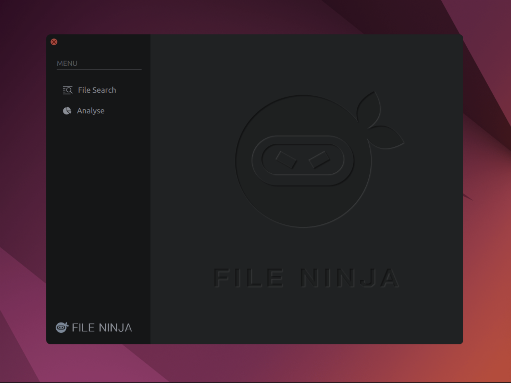
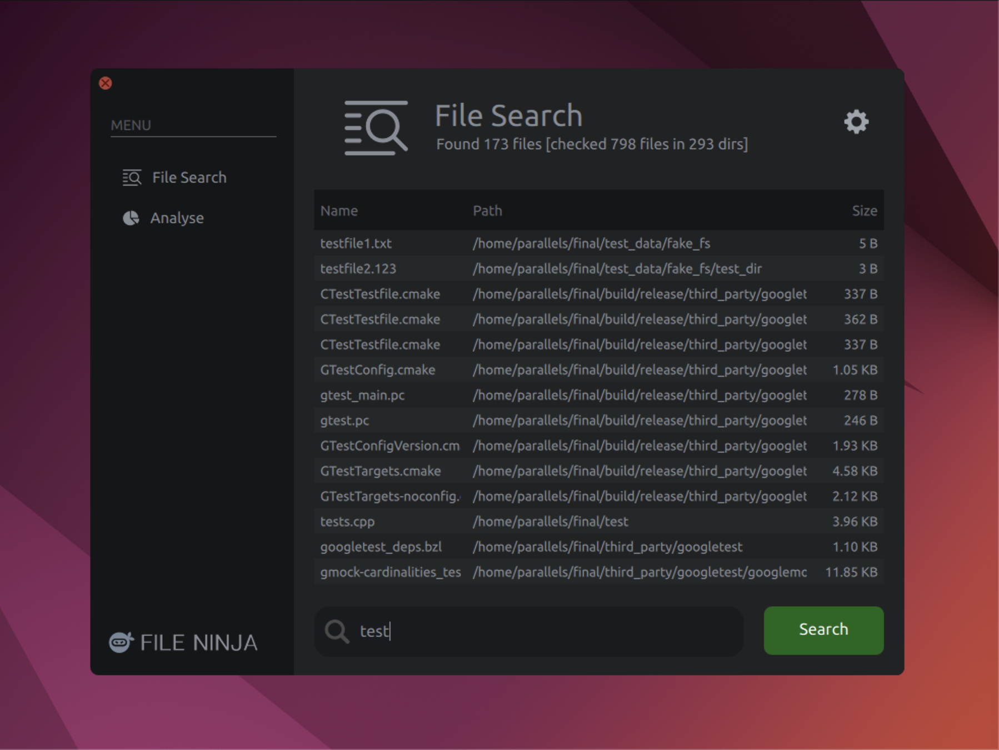
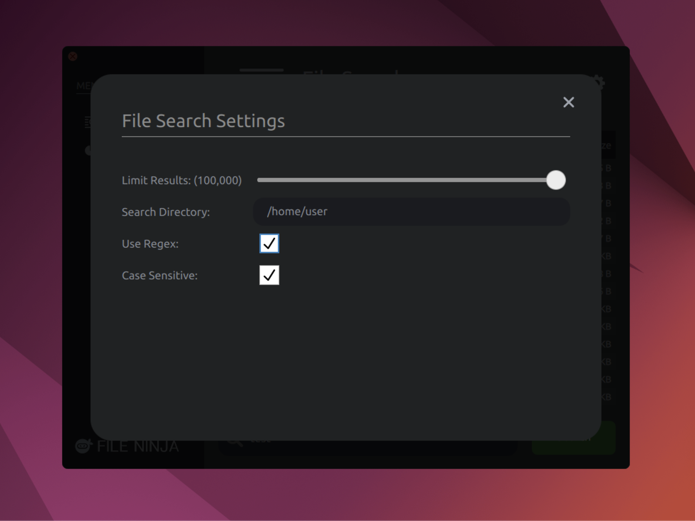
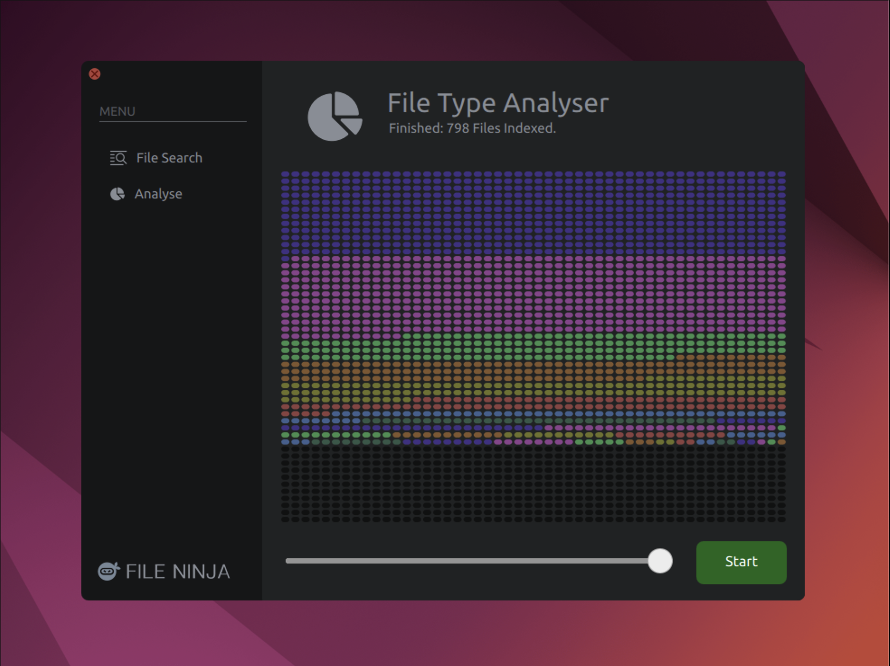
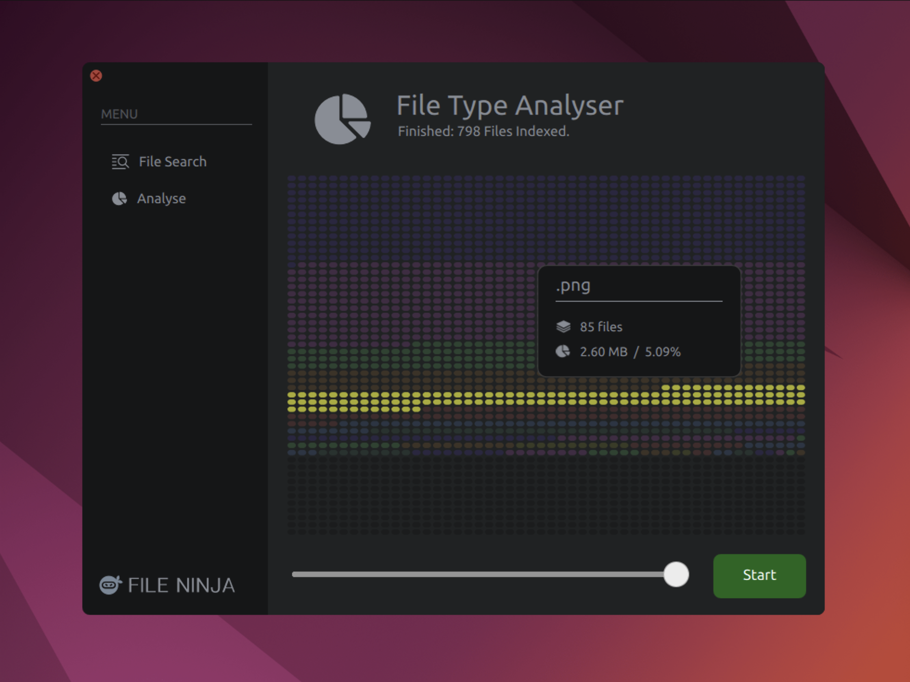

# Readme

Capstone final project. This project supports Ubuntu 22.04 and macOS.
### Please ensure the Qt5 depenencies listed below are installed:


<br>

## Installing Qt 5.15

### Ubuntu (22.04):
``` bash
sudo apt update

sudo apt install git g++ cmake gcc qtdeclarative5-dev qtbase5-dev qt5-qmake qtquickcontrols2-5-dev qml-module-qtqml qml-module-qtquick-controls2 qml-module-qtquick2 qml-module-qtquick-window2 qml-module-qtquick-layouts
```

### macOS:
The easiest way to install Qt5 on macOS is using brew (https://brew.sh/)
``` zsh
/bin/bash -c "$(curl -fsSL https://raw.githubusercontent.com/Homebrew/install/HEAD/install.sh)"

brew install qt@5 cmake
```
<br>

## Build Steps

### 1.  Clone the repository

``` bash
git clone https://github.com/jprojt/file_ninja.git
cd file_ninja
git submodule init
git submodule update --recursive
```

### 2. Build the project
``` bash
make release
```

### 3. Run
```
make run_release
```


<br><br>
# Screenshots












